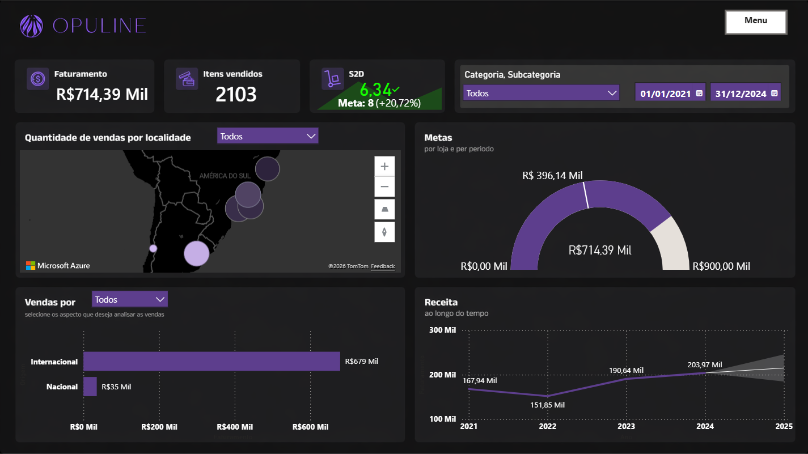

# 📊 Projeto Opuline

## 🧠 Sobre o Projeto

O **Projeto Opuline** é um dashboard interativo desenvolvido a partir da base de dados do curso **Power BI: visualizando e analisando dados** da plataforma **Alura** com foco em **análise de dados comerciais**, permitindo acompanhar indicadores estratégicos como faturamento, desempenho de vendas, metas e distribuição geográfica.

O objetivo principal é transformar dados brutos em **insights visuais claros e acionáveis**, auxiliando na tomada de decisão orientada por dados.

---

## 🎯 Objetivos

* Monitorar o **faturamento ao longo do tempo**
* Analisar o desempenho de **vendas por categoria e localidade**
* Comparar resultados com **metas estabelecidas**
* Identificar padrões e tendências de crescimento
* Criar uma visualização intuitiva e profissional

---

## 🛠️ Tecnologias Utilizadas

* **Power BI** → criação do dashboard e visualizações
* **Excel / CSV** → fonte de dados

---

## 📈 Principais Indicadores (KPIs)

* 💰 Faturamento total
* 📦 Itens vendidos
* 🎯 Atingimento de metas
* 📊 Receita ao longo do tempo
* 🌎 Distribuição geográfica de vendas

---

## 📊 Funcionalidades do Dashboard

* Filtros dinâmicos por:

  * Categoria
  * Subcategoria
  * Período (data)
* Navegação entre abas (Vendas e Produtos)
* Visualização geográfica interativa
* Comparação entre vendas nacionais e internacionais
* Indicadores visuais de desempenho (KPIs)

---

## 🧩 Estrutura do Projeto

```
📁 Projeto_Opuline
│-- 📄 README.md
│-- 📊 dashboard.pbix
│-- 📁 dados
│   └── base_de_dados.xlsx
│-- 📁 imagens
│   └── preview_dashboard.png
```

---

## 🚀 Como Utilizar

1. Faça o download do arquivo `.pbix`
2. Abra no **Power BI Desktop**
3. Atualize a base de dados, se necessário
4. Navegue pelos filtros e abas para explorar os dados

---

## 📸 Preview do Dashboard



---

## 📌 Insights Gerados

* Identificação de regiões com maior volume de vendas
* Comparação entre mercados nacional e internacional
* Evolução do faturamento ao longo dos anos
* Análise de atingimento de metas

---

## 🧑‍💻 Autor

**Davi Estevam**
🎓 Estudante de Ciência de Dados e IA
💼 Aprendizado em Power BI, análise de dados e dashboards

---

## 📬 Contato

* LinkedIn: *(https://www.linkedin.com/in/daviestv/)*
* GitHub: https://github.com/DaviEstev

---

## ⭐ Considerações Finais

Este projeto foi desenvolvido com o objetivo de **praticar e demonstrar habilidades em análise de dados**, construção de dashboards e storytelling com dados.

Sugestões e feedbacks são sempre bem-vindos!
